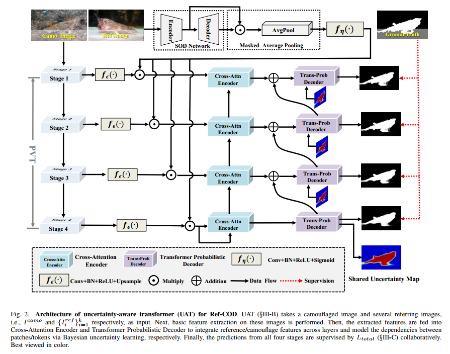
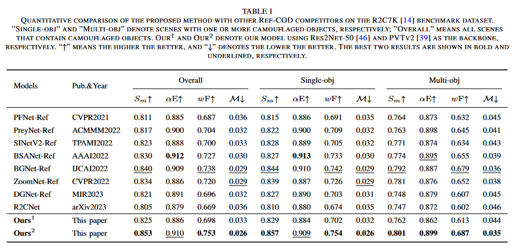

# Uncertainty-Aware Transformer for Referring Camouflaged Object Detection

  
   Figure.2 The overall architecture of the proposed UATNet for referring camouflaged bbject detection. 

# 1.Requirements
Python v3.6, Pytorch 0.4.0+, Cuda 10.0, TensorboardX 2.0, opencv-python

# 2.Data Preparation
Please visiting [RefCOD](https://github.com/zhangxuying1004/RefCOD) for training and testing data. Thanks for their contributions.

# 3.Training & Testing
The source code will be made publicly available soon, please waiting...

# 4.Results
* **Qualitative comparison**

  
Table.1 Quantitative comparison with some SOTA models on referring camouflaged bbject detection benchmark datasets. 

* **Salmaps**
The salmaps of the above datasets can be download from [BaiDu](https://pan.baidu.com/s/1PETllwKaHRtduNpzyGmftQ)[code:NUST] or [Google](https://drive.google.com/file/d/1xNDCYIrzn45KsRcIt4S0DfOuN_fvhLB0/view?usp=drive_link).
